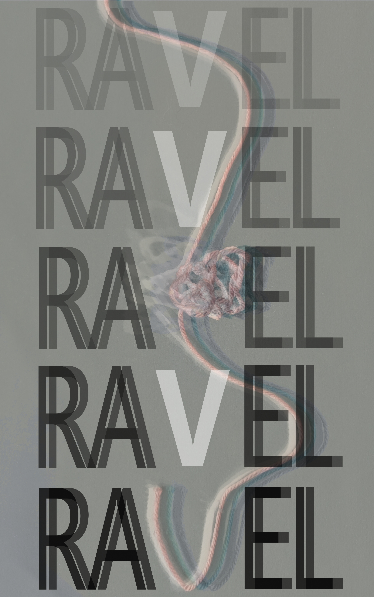

  

# Ravel

### A Game of Threads

*by Mostly Fuzz Studio*

---

Ravel is a tabletop RPG where the fiction is the engine. There are no hit points, no skill lists, no combat rounds. You play characters connected by relationships, secrets, and unresolved questions. You earn dice by honoring what's been established about your character. You spend dice to pull on threads and discover what's true.

Every answer creates new questions. Every truth complicates something else. That's the game.

**3-4 players + GM. Six-sided dice. Fits on an index card.**

---

**[The Rulebook](RULEBOOK.md)** - Everything you need to play.

**[The Harrow](looms/the-harrow.md)** - A starter scenario. Six crew on a cargo hauler. Something changed the course while they slept.

**[Design Notes](DESIGN.md)** - The philosophy behind the game. Why this engine, why these choices.

**[Playtest Notes](playtests/)** - What we've learned so far.

---

*Ravel is in active development and playtesting. If you play it, we want to hear what happened.*

*Copyright 2026 Mostly Fuzz Studio. All rights reserved.*
